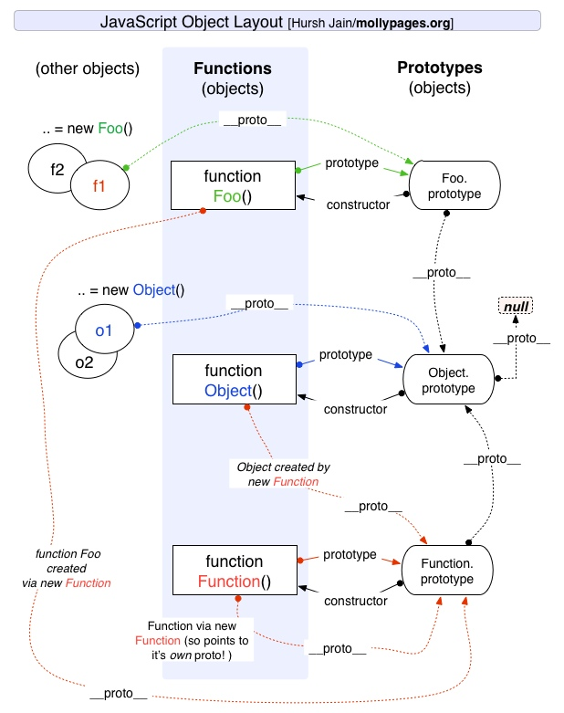

# 原型链

## 记忆
1.原型链包括实例,函数,函数原型三部分.
2.prototype是一个函数所有,指向函数原型.
3.__proto__是一个实例所有,指向实例的函数原型.
4.函数的__proto__,指向Function.prototype,因为函数在js中本身也是一个对象.
5.所有函数prototype的__proto__指向Object.prototype.
6.Object.prototype的__proto__指向null.
7.函数prototype中还有一个constructor,指向构造函数.

## 总结
1.Object是所有对象的爸爸,所有对象都可以通过__proto__找到它.
2.Function是所有函数的爸爸,所有函数都可以通过__prototype__找到它.
3.Function.prototype和Object.prototype是两个特殊的对象,他们由引起创造.
4.除了以上两个对象,其他对象都可以通过构造器new出来.
5.函数的prototype是一个对象,也就是原型.
6.对象的__proto__指向原型,__proto__将对象和原型链接起来组成原型链.

